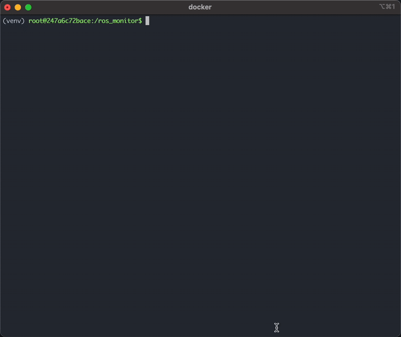

# ROS_MONITOR
ros_monitor is inspired by cyber_monitor. It provides a text-based user interface (TUI) for visualizing ROS topics, their message types, and live topic data—all in one place. With ros_monitor, you no longer need to memorize ROS CLI commands, making it easy to inspect and interact with your ROS system efficiently from a single, streamlined tool.

TODO:
- [ ] Add more unit tests, use textuals framework
- [ ] Add command line parsing, maybe you only need to inspect 1 topic or a group of specific topics
- [ ] Add configs, right now the topics update at 1hz and the echo updates at 10hz
- [ ] Publish to pypi
- [ ] Need to test with custom topics and integrate with other workspaces
